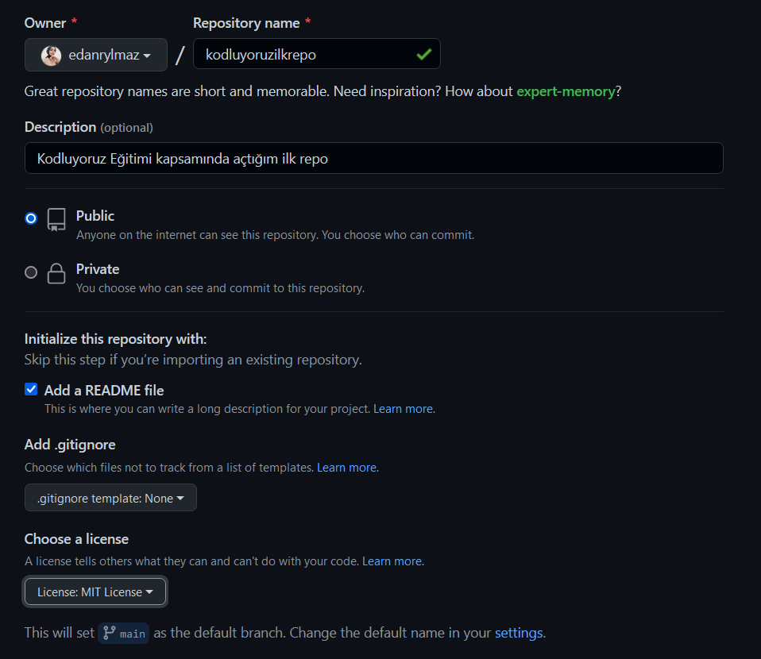

# kodluyoruzilkrepo
Kodluyoruz Eğitimi kapsamında açtığım ilk repo. [PatikaDev](htttps://www.patika.dev)
## Repo Oluşturma
---

## Installation
---
* Repo oluşturulduktan sonra aşağıdaki git komutu çalıştırılır ve repo kopyalanır.

``` git clone https://github.com/edanrylmaz/kodluyoruzilkrepo.git ```

## Usage
---
* Daha sonra VSCode (ya da başka bir ide) açılarak proje dosyasına **index.html** dosyası eklenir.
* Oluşturulan değişiklikler sırasıyla önce ***tracked*** hale getirilir daha sonra ***commit*** komutu ile snapShot alınır ve son olarak ***push*** komutu ile sunucuya gönderilir. Komutlar sırasıyla ;

```
# tüm değişiklikleri eklemek için
git add . 
```
```
git commit -m 'index.html dosyası eklendi, ReadMe dosyası düzenlendi' 
```
```
git push
```
